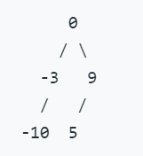

# OJBook
Leetcode 题解
<!-- TOC -->

- [OJBook](#ojbook)
    - [35 矩阵置零](#35-矩阵置零)
    - [43 字符串相乘](#43-字符串相乘)
    - [53 最大子序和](#53-最大子序和)
    - [70 爬楼梯](#70-爬楼梯)
    - [108 将有序数组转换为二叉搜索树](#108-将有序数组转换为二叉搜索树)
    - [121 买卖股票的最佳时机](#121-买卖股票的最佳时机)

<!-- /TOC -->
## 35 矩阵置零

给定一个 m x n 的矩阵，如果一个元素为 0，则将其所在行和列的所有元素都设为 0。请使用原地算法。

> 示例: 输入: 
  [
    [1,1,1],
    [1,0,1],
    [1,1,1]
  ]
  输出: 
  [
    [1,0,1],
    [0,0,0],
    [1,0,1]
  ]

1. 一个直接的解决方案是使用  O(mn) 的额外空间

    即直接声明一个相同大小的矩阵, 当原矩阵当中元素有0时将对应的行和列赋值为-1作为标记, 然后遍历再一遍原矩阵把应该是零的位置进行赋值

    ```java
        /**
         * 解决方案一, 占用O(mn)的额外空间
         *
         * @param matrix
         */
        public void setZeroes(int[][] matrix) {
            int[][] newMatrix = new int[matrix.length][matrix[0].length];
            for (int i = 0; i < matrix.length; i++) {
                for (int j = 0; j < matrix[0].length; j++) {
                    if (matrix[i][j] == 0) {
                        setColRowZero(newMatrix, i, j);
                    }
                }
            }
            for (int i = 0; i < matrix.length; i++) {
                for (int j = 0; j < matrix[0].length; j++) {
                    matrix[i][j] = newMatrix[i][j] == -1 ? 0 : matrix[i][j];
                }
            }
        }
        /**
         * 将某行某列全置为-1
         *
         * @param newMatrix
         * @param i
         * @param j
         */
        private void setColRowZero(int[][] newMatrix, int i, int j) {
            Arrays.fill(newMatrix[i], -1);
            for (int k = 0; k < newMatrix.length; k++) {
                newMatrix[k][j] = -1;
            }
        }
    ```

2. 一个简单的改进方案是使用 O(m + n) 的额外空间
   
   即声明对应行数和列数的数组用于标记, 这样即知道了哪一行和哪一列需要被置为零, 之后再遍历赋值即可
   ```java
           /**
            * 解决方案二, 占用O(m+n)的额外空间
            * @param matrix
            */
           public void setZeroes2(int[][] matrix) {
               int[] labelForRow = new int[matrix.length];
               int[] labelForCol = new int[matrix[0].length];
       
               for (int i = 0; i < matrix.length; i++) {
                   for (int j = 0; j < matrix[0].length; j++) {
                       if (matrix[i][j] == 0) {
                           labelForRow[i] = 1;
                           labelForCol[j] = 1;
                       }
                   }
               }
               for (int i = 0; i < matrix.length; i++) {
                   for (int j = 0; j < matrix[0].length; j++) {
                       matrix[i][j] = labelForCol[j] == 1 || labelForRow[i] == 1 ? 0 : matrix[i][j];
                   }
               }
           }
    ```
    
3. 一个常数空间的解决方案
    
    即直接在原数组上进行标记, 但要注意不能将非行末或者非列末的零元素进行标记, 原因是你标记之后会抵消原有零的作用
    ```java
        /**
         * 解决方案三, 占用常数的额外空间
         * @param matrix
         */
        public void setZeroes3(int[][] matrix) {
            for (int i = 0; i < matrix.length; i++) {
                for (int j = 0; j < matrix[0].length; j++) {
                    if (matrix[i][j] == 0) {
                        matrix[i][j] = 66666;
                        for (int k = 0; k < matrix.length; k++) {
                            matrix[k][j] = matrix[k][j] == 0 ? (i == matrix.length - 1 ? 66666 : matrix[k][j]) : 66666;
                        }
                        for (int k = 0; k < matrix[0].length; k++) {
                            matrix[i][k] = matrix[i][k] == 0 ? (j == matrix[0].length - 1 ? 66666 : matrix[i][k]) : 66666;
                        }
                    }
                }
            }
            for (int i = 0; i < matrix.length; i++) {
                for (int j = 0; j < matrix[0].length; j++) {
                    matrix[i][j] = matrix[i][j] == 66666 ? 0 : matrix[i][j];
                }
            }
        }
    ```
## 43 字符串相乘

给定两个以字符串形式表示的非负整数 num1 和 num2，返回 num1 和 num2 的乘积，它们的乘积也表示为字符串形式。

实例：
> 输入: num1 = "2", num2 = "3"
> 输出: "6"
> 输入: num1 = "123", num2 = "456"
> 输出: "56088"

考虑两数乘法相乘法则，num1中第i位数与num2中第j位数相乘得到的结果位于第i+j位（索引从0开始）。因此从第0位开始，考虑相乘的结果位于第0位的组合，显然只有num1和num2同取第0位这种组合，相乘后将对10取模作为个位，相乘对10整除作为进位，接着考虑第1位，显然组合情况有num1取第0位，num2取第1位；num1取第1位，num2取第0位这两种情况，将这两种情况相乘得到的结果相加并加上之前的进位，还是对10取模作为这个位置上的数，对10整除作为进位，依次类推。
```c++
class Solution {
public:
    string multiply(string num1, string num2) {
        //处理num1和num2都为0时的特殊情况
        if(num1 == "0" || num2 == "0"){
            return "0";
        }
        //默认num1长度大于等于num2，如果不是，交换2个数
        if(num1.length() < num2.length()){
            string temp;
            temp = num1;
            num1 = num2;
            num2 = temp;
        }
        string result = "";//储存最后相乘结果
        int i,j;
        int len1 = num1.length();//num1长度
        int len2 = num2.length();//num2长度
        int add = 0;
        //从第0位开始，到len2 + len1 - 2位为止
        for(i = len1 + len2 - 2;i >= 0;i--){
            int num = 0;
            // 得到所有位数之和等于i的组合，相加之后并加上之前的进位
            for(j = len2 - 1;j >=0;j--){
                int index = i - j;
                if(index >= 0 && index < len1){
                    int a = num1[index] - '0';
                    int b = num2[j] - '0';
                    num += a*b;
                }
            }
            num += add;
            // 结果整除10作为下次进位
            add = num / 10;
            //结果mod10作为这个位置上的数
            char a = '0' + num % 10;
            result  = a + result;
        }
        //最后处理一下最高位的进位
        if(add != 0){
            stringstream ss;
            ss<<add;
            result  = ss.str() + result;
        }
        return result;
    }
};


## 53 最大子序和

给定一个整数数组 nums ，找到一个具有最大和的连续子数组（子数组最少包含一个元素），返回其最大和。

示例:
> 输入: [-2,1,-3,4,-1,2,1,-5,4],
> 输出: 6
> 解释: 连续子数组 [4,-1,2,1] 的和最大,为6。

1. 比较tricky的解法

    原理为从一开始就开始求和, 然后记录最大值, 当和小于0的时候, 重新开始求和
    
    其中理由为, 如果这个和的值小于0, 那么必不可能是某段最大和序列的前缀
```java
    public int maxSubArray(int[] nums) {
        int sum = 0;
        int max = Integer.MIN_VALUE;
        for (int i = 0; i < nums.length; i++) {
            sum += nums[i];
            if (sum > max) {
                max = sum;
            }
            if (sum <= 0) {
                sum = 0;
            }
        }
        return max;
    }
```

## 70 爬楼梯

假设你正在爬楼梯。需要 n 阶你才能到达楼顶。
      
每次你可以爬 1 或 2 个台阶。你有多少种不同的方法可以爬到楼顶呢？

注意：给定 n 是一个正整数。

> 示例1:
    输入： 2
    输出： 2


1. 动态规划问题, 使用一个数组作为记录:
    
    其中note就是记录的数组, note[i]就是还剩下i阶楼梯时的到楼顶的方法数
    ```java
        public int climbStairs(int n) {
            int[] note = new int[n + 1];
            for (int i = 0; i <= n; i++) {
                if (i == 0) {
                    note[i] = 0;
                } else if (i == 1) {
                    note[i] = 1;
                } else if (i == 2) {
                    note[i] = 2;
                } else {
                    note[i] = note[i - 1] + note[i - 2];
                }
            }
            return note[n];
        }
    ```

##108 将有序数组转换为二叉搜索树
将一个按照升序排列的有序数组，转换为一棵高度平衡二叉搜索树。

本题中，一个高度平衡二叉树是指一个二叉树每个节点 的左右两个子树的高度差的绝对值不超过 1。

> 示例:
> 给定有序数组: [-10,-3,0,5,9],
> 一个可能的答案是：[0,-3,9,-10,null,5]，它可以表示下面这个高度平衡二叉搜索树：



只需要递归地构造左子树和右子树即可

```java
    public TreeNode sortedArrayToBST(int[] nums) {
        if (nums.length == 0) {
            return null;
        }
        TreeNode root = new TreeNode(nums[nums.length / 2]);// 3/2 = 1, 5/2 = 2 that is the middle position
        createBST(root, nums, nums.length / 2 + 1, nums.length - 1, 1);
        createBST(root, nums, 0, nums.length / 2 - 1, 2);
        return root;
    }

    private void createBST(TreeNode node, int[] nums, int start, int end, int flag) {
        int length = end - start + 1;
        if (start > end) {
            return;
        }
        if (flag == 1) {
            node.right = new TreeNode(nums[start + length / 2]);
        } else {
            node.left = new TreeNode(nums[start + length / 2]);
        }
        if (start < end) {
            createBST(flag == 1 ? node.right : node.left, nums, start + length / 2 + 1, end, 1);
            createBST(flag == 1 ? node.right : node.left, nums, start, start + length / 2 - 1, 2);
        }
    }
```

## 121 买卖股票的最佳时机
给定一个数组，它的第 i 个元素是一支给定股票第 i 天的价格。

如果你最多只允许完成一笔交易（即买入和卖出一支股票），设计一个算法来计算你所能获取的最大利润。

注意你不能在买入股票前卖出股票

> 示例1:
    输入: [7,1,5,3,6,4]
    输出: 5
    
1. 动态规划问题

    解法为声明一个数据用于记录, 循环中不断记录最小值以及当前收益最大值, 不断利用当前收益和以往的比较, 保留较大者
    
    ```java
        public int maxProfit(int[] prices) {
            int n = prices.length;
            if (n == 0) {
                return 0;
            }
            int min = prices[0];
            int positionOfMin = 0;
            int[] note = new int[n];
            for (int i = 0; i < n; i++) {
                if (prices[i] < min) {
                    positionOfMin = i;
                    min = prices[i];
                }
                if (i == 0) {
                    note[i] = 0;
                } else if (i == 1) {
                    note[i] = prices[1] > prices[0] ? prices[1] - prices[0] : 0;
                } else {   
                    note[i] = prices[i] - prices[positionOfMin] > note[i - 1] ? (prices[i] - prices[positionOfMin]) : note[i - 1];
                }
            }
            return note[n - 1];
        }
    ```